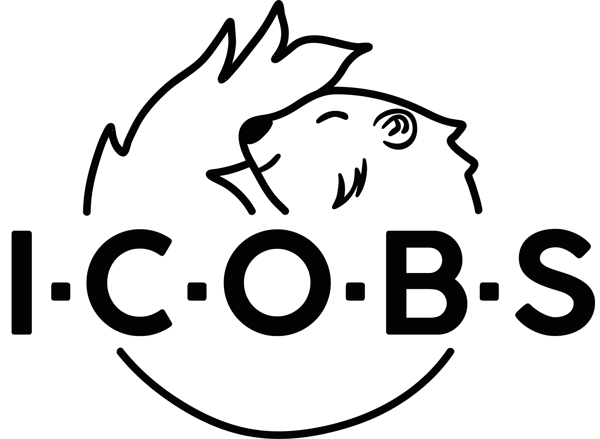

Ibex Core Based System light
================================================================

```hs
# Get rid of the *.zoneIdentifier
Get-ChildItem -Path "C:\projets_polytech\VHDL_Icobs_Project\Hardware" -Recurse -Filter "*.zoneIdentifier" | Remove-Item
```

<div align="center"></div>

# Project structure

In this project you will find all the source files used by ICOBS light as well as a TCL script to automatically generate the Vivado project.

- **generate_ICOBS_light_PROJECT.tcl**: Project generation script
- **ICOBS_light**:
    - **COE**: ROM initialisation file
    - **FPGA**: Constraint files for Nexys-Video
    - **IMG**: Bloc diagrams and logos
    - **IP**: IP description files
    - **RTL**: HDL files

# Requirement

- **Vivado 2020.2**

# Project generation

To generate this project, launch the generate_ICOBS_light_PROJECT.tcl script with vivado in batch mode :

Windows:

```
C:\Xilinx\Vivado\2020.2\bin\vivado.bat -mode batch -source generate_ICOBS_light_PROJECT.tcl
```

Linux:

```
/tools/Xilinx/Vivado/2020.2/bin/vivado -mode batch -source generate_ICOBS_light_PROJECT.tcl
```

This script will generate the complete project in a new directory called: ICOBS_light_PROJECT_DIR.
Once the script execution is complete, you can open the project (ICOBS_light_PROJECT_DIR.xpr) in Vivado and start the bitstream generation.
